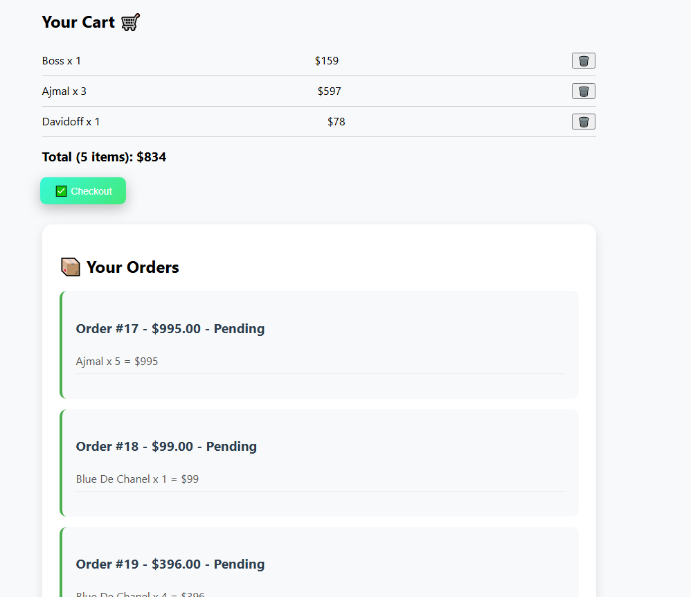
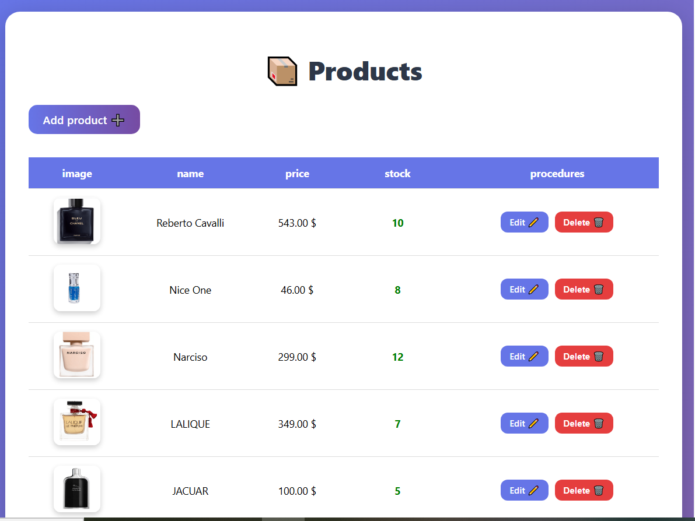

# 🛍️ Laravel E-Commerce Project

A simple yet powerful e-commerce website built with **Laravel** and **MySQL**.

## 📋 Project Overview
This project allows users to browse products, add items to their cart, and place orders.  
Admins can manage products, track sales, and update the store’s content from an easy-to-use dashboard.

## 🚀 Features
- User & Admin authentication system  
- Product management (CRUD)  
- Shopping cart with quantity tracking  
- Order management  
- Admin dashboard  
- Responsive design (Bootstrap)  
- Multi-language support (Arabic / English)

## 🛠️ Technologies Used
- **Laravel 10**  
- **MySQL**  
- **Blade Templates**  
- **Bootstrap 5**  
- **JavaScript / jQuery**

## 📸 Screenshots

<p align="center">
  
  
</p>

<p align="center">
  
  
</p>

## 💡 How to Run the Project
1. Clone the repository:  
   ```bash
   https://github.com/Abdurahman4/E-commerce.git
